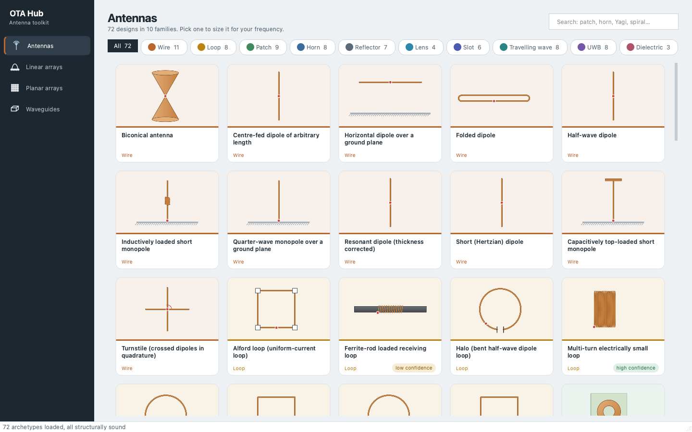
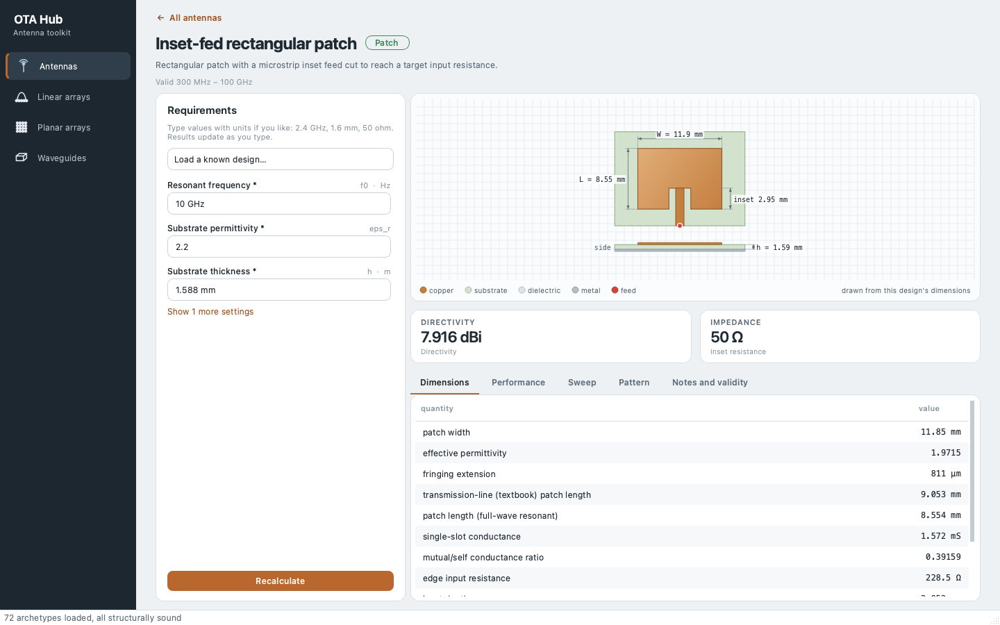
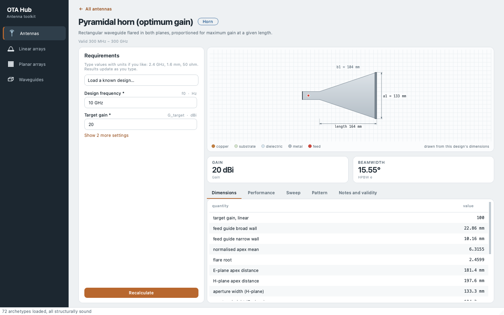
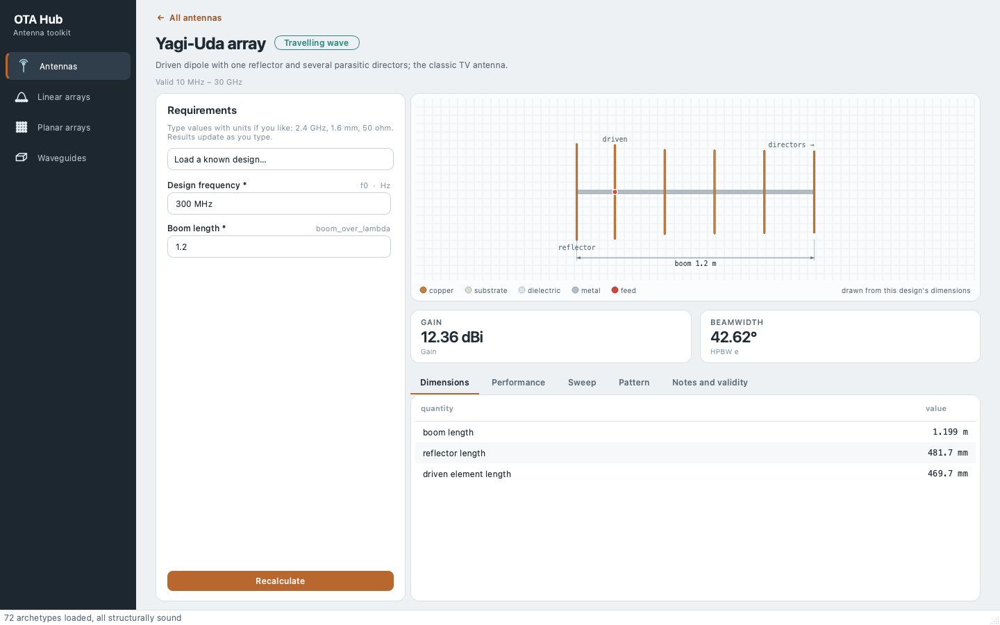
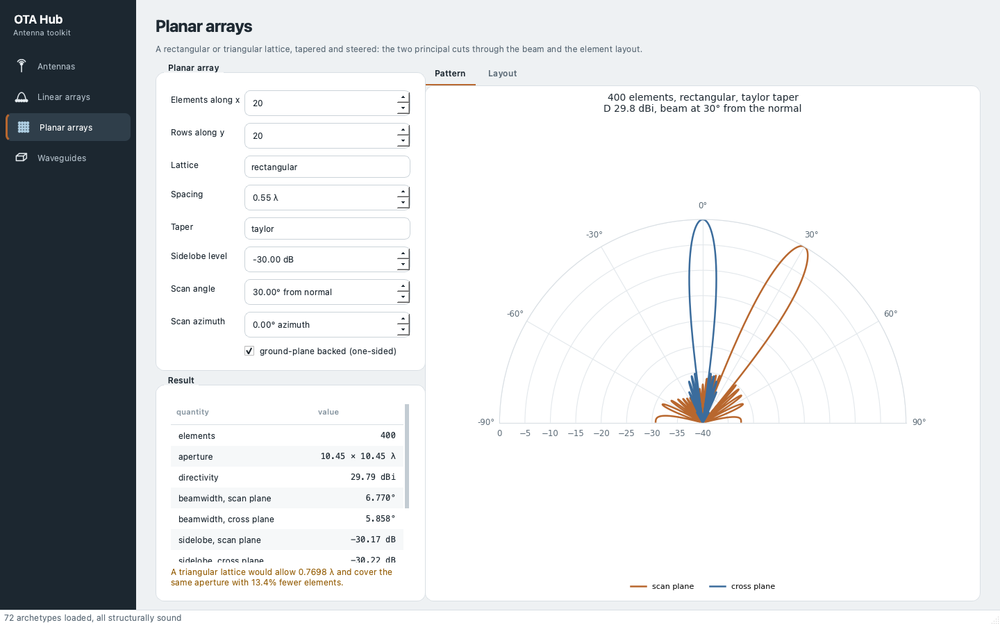
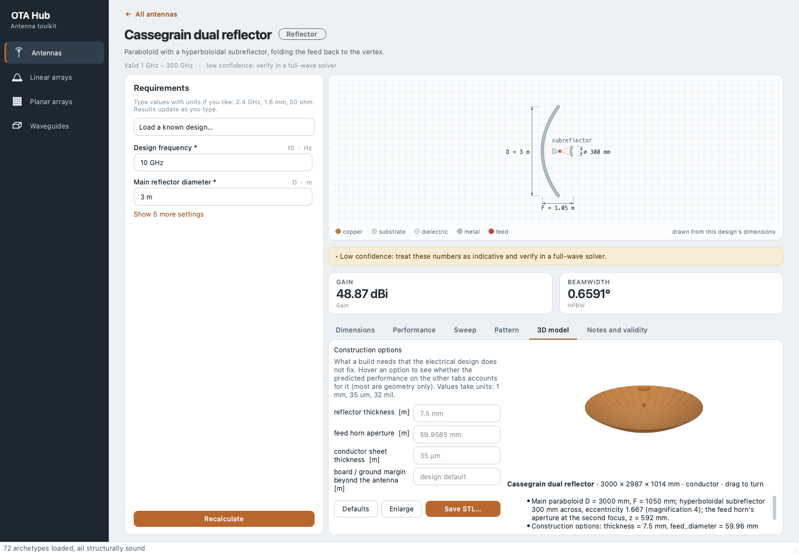

<div align="center">

# OTA Hub Antenna Toolkit

**State what the antenna must do. Get its geometry, its predicted performance, and a model for your full-wave solver.**

72 antenna archetypes · arrays · waveguides · matching · CST & HFSS export · a desktop GUI


[](https://github.com/alasulu/antenna-design-app/actions/workflows/tests.yml)
[](https://codespaces.new/alasulu/antenna-design-app?quickstart=1)




</div>

---

## Contents

- [What it is](#what-it-is)
- [Quick start](#quick-start)
- [A tour](#a-tour)
- [The catalogue](#the-catalogue)
- [How it works: antennas are data](#how-it-works-antennas-are-data)
- [Verified, not asserted](#verified-not-asserted)
- [Arrays, waveguides and networks](#arrays-waveguides-and-networks)
- [Export to CST Studio and Ansys HFSS](#export-to-cst-studio-and-ansys-hfss)
- [3-D models (STL) and construction options](#3-d-models-stl-and-construction-options)
- [What it will not do](#what-it-will-not-do)
- [Project layout](#project-layout)
- [Deep dives](#deep-dives)
- [References](#references)
- [License](#license)

## What it is

An open antenna-design workbench in the spirit of tools like Antenna Magus. You
pick an antenna — a patch, a horn, a Yagi, a reflector, a loop, a lens — give it
your requirements (frequency, gain, substrate, impedance…), and it returns:

- **the geometry**, every dimension you need to build or model it;
- **the predicted performance** — impedance, directivity and gain, beamwidths,
  sidelobes, bandwidth, Q, efficiency — with the model behind each number named;
- **a simulator model**: a CST Studio VBA macro or an Ansys HFSS script with the
  design's variables, ports and frequency sweep already set up;
- **a 3-D solid model** of every one of the 72 antennas, previewed in the app and
  saved as STL - one file per material - with the construction choices a build
  needs (wall and copper thickness, wire radius, board margin, substrate) yours to set.

What sets it apart is how hard it works to be **right** rather than plausible.
Antenna formulas are full of coefficients that look correct and are not, so
every cited textbook value is an executable test, and the toolkit carries its own
full-wave solvers — method of moments, FDTD, spectral-domain MoM, mode matching —
to check the closed forms it uses. Where a textbook rule was wrong, the spec now
says by how much and why.

| | |
|---|---|
| **72** archetypes in **10** families | **464** cited known cases, **1104** expectations, all passing |
| **21** in-house numerical solvers | **3536** automated tests |
| CST and HFSS export for **42** archetypes, **3-D STL for all 72** | a PySide6 desktop GUI that draws every antenna from its own numbers, in 2-D and 3-D |

## Quick start

**In the browser, nothing to install:** the *Open in GitHub Codespaces* badge above
starts a cloud machine with the toolkit installed and the desktop app open on a
virtual screen. Open port **6080** from the Ports tab, click Connect (password
`vscode`), and the app is there; the terminal runs the command line. See
[`.devcontainer/README.md`](.devcontainer/README.md).

**On your own machine:**

```bash
git clone https://github.com/alasulu/antenna-design-app.git
cd antenna-design-app
pip install -e ".[gui,dev]"          # numpy, scipy, matplotlib; PySide6 + manifold3d for the GUI and 3-D; pytest
```

Then either open the desktop app:

```bash
python OTA_Hub_AntennaToolkit.py gui
```

or drive it from the command line (`otahub` is installed as a command too):

```bash
python OTA_Hub_AntennaToolkit.py list                                   # the catalogue
python OTA_Hub_AntennaToolkit.py synth half_wave_dipole --f0 2.4GHz     # design one
python OTA_Hub_AntennaToolkit.py synth rectangular_patch_inset --f0 2.4GHz --set eps_r=4.4 --set h=1.6mm
python OTA_Hub_AntennaToolkit.py export rectangular_patch_inset --f0 2.4GHz \
    --set eps_r=4.4 --set h=0.0016 --format cst -o patch.bas            # a CST macro
python OTA_Hub_AntennaToolkit.py export pyramidal_horn --f0 10GHz --set G_target=20 \
    --format stl --opt wall=1.5mm -o horn.stl                           # a 3-D model
python OTA_Hub_AntennaToolkit.py check                                  # every cited case
```

Frequencies and `--set` values take units — `2.4GHz`, `1.6mm`, `75ohm`, `13deg`, `5.8e7S/m`.

<details>
<summary><b>More commands</b>: arrays, waveguides, lines, matching, Touchstone, horns, stacks</summary>

```bash
python OTA_Hub_AntennaToolkit.py array -n 16 --taper chebyshev --sll -30
python OTA_Hub_AntennaToolkit.py planar --nx 16 --ny 16 --taper chebyshev --sll 30 --scan 45
python OTA_Hub_AntennaToolkit.py planar --nx 12 --ny 12 --lattice triangular --d 0.62
python OTA_Hub_AntennaToolkit.py planar --nx 16 --ny 16 --scan 30 --element cos     # with an element pattern
python OTA_Hub_AntennaToolkit.py planar --nx 33 --ny 33 --circle 8 --taper taylor-circular --sll 35 --thin 7
python OTA_Hub_AntennaToolkit.py guide WR-90 --f0 10GHz
python OTA_Hub_AntennaToolkit.py line microstrip --z0 50 --h 1.6mm --eps-r 4.4
python OTA_Hub_AntennaToolkit.py match --r 200 --x -100 --z0 100 --f0 500MHz
python OTA_Hub_AntennaToolkit.py touchstone measured.s1p --compare half_wave_dipole
python OTA_Hub_AntennaToolkit.py potter --f0 10GHz --L 0.3 --band      # a dual-mode horn's step and phasing, solved jointly
python OTA_Hub_AntennaToolkit.py stack --f0 2.4GHz --h 1.6mm -v        # a stacked patch's band and probe position (a full-wave solve: minutes)
python OTA_Hub_AntennaToolkit.py doctor                                # structural faults in the specs
```

</details>

## A tour

<table>
<tr>
<td width="50%"><br><sub><b>Inset-fed patch.</b> Requirements on the left, the patch drawn to scale from the computed dimensions, headline figures and the full results. The built length is the one that resonates full-wave; the textbook length is kept beside it.</sub></td>
<td width="50%"><br><sub><b>Pyramidal horn for 20 dBi at 10 GHz.</b> Both flares solved to meet the feed guide together, gain exact in Fresnel integrals at any flare.</sub></td>
</tr>
<tr>
<td width="50%"><br><sub><b>Yagi-Uda.</b> The NBS Technical Note 688 designs, re-solved by the method of moments — NBS tabulates dBd, not dBi, and the spec now knows it.</sub></td>
<td width="50%"><br><sub><b>Planar array.</b> Rectangular or triangular lattices, tapers, steering, exact directivity and both principal cuts.</sub></td>
</tr>
<tr>
<td colspan="2"><br><sub><b>3D model.</b> The solid that will be saved as STL - here a Cassegrain's main dish, hyperboloidal subreflector and feed horn - rebuilt as the requirements or the construction options change, with each option saying whether the predicted figures account for it.</sub></td>
</tr>
</table>

## The catalogue

| Family | n | Archetypes |
|---|---|---|
| Wire | 11 | half-wave, resonant, short and arbitrary-length dipoles (exact in Si/Ci), dipole over ground, quarter-wave, top-loaded and inductively loaded monopoles, folded dipole, biconical, turnstile |
| Patch | 9 | rectangular, inset-fed, circular, triangular, annular ring, quarter-wave shorted, truncated-corner CP, PIFA, stacked |
| Loop | 8 | small circular and square, multi-turn, ferrite rod, one-wavelength loop, quad, halo, Alford |
| Horn | 8 | pyramidal, E- and H-plane sectoral, conical, corrugated, diagonal, dual-mode (Potter), open-ended waveguide |
| Travelling wave | 8 | Yagi-Uda, log-periodic dipole array, axial- and normal-mode helix, terminated long wire, V, rhombic, leaky-wave line source |
| Wideband | 8 | bowtie, disc and rectangular planar monopoles, Archimedean and equiangular spirals, Vivaldi, discone, conical monopole |
| Reflector | 7 | prime-focus and offset paraboloids, Cassegrain, Gregorian, parabolic cylinder, 90° and 60° corner reflectors |
| Slot | 6 | half-wave, cavity-backed, folded, waveguide longitudinal, resonant and travelling-wave slot arrays |
| Lens | 4 | plano-hyperbolic dielectric, Luneburg, Fresnel zone plate, metal-plate |
| Dielectric resonator | 3 | cylindrical, hemispherical, rectangular |

Eight archetypes are marked **low confidence** — `cassegrain`, `conical_horn_dual_mode`,
`ferrite_rod_loop`, `pifa`, `planar_monopole_circular`, `stacked_patch`,
`vivaldi_tsa`, `waveguide_longitudinal_slot` — and say so in the CLI, the GUI and
every design they produce. [`docs/HANDOVER.md`](docs/HANDOVER.md) says what each one lacks.

## How it works: antennas are data

Every archetype is a JSON document in [`specs/`](specs/): its parameters, the
synthesis and analysis formulas as **strings**, validity ranges, citations, and
`known_cases` — published or independently computed results it must reproduce.
A whitelisted AST evaluator ([`otahub/core/expr.py`](otahub/core/expr.py)) runs
the formulas.

```jsonc
{
  "metric": "eta_blockage",
  "expr": "(1 - np.trapezoid(...)/np.trapezoid(...))**2",     // field-weighted, not (1 - (d/D)^2)^2
  "depends_on": ["d_blockage", "D", "f_over_D", "feed_n", "feed_theta0"],
  "notes": "The square of the fraction of the aperture FIELD outside a central blocked disc..."
}
```

That design buys three things:

1. **Adding an antenna needs no Python.** A spec file is the whole contribution,
   and it gets a CLI entry and a GUI page for free.
2. **Nothing in a spec can execute.** Imports, attribute escapes,
   comprehensions, lambdas and keyword tricks are rejected — enforced by test.
3. **Every cited number is a test.** Each known case becomes a pytest case, so a
   formula that drifts from its reference fails the build instead of quietly
   producing a plausible, wrong antenna.

The engine refuses rather than guesses: unknown symbols are errors, never zero;
missing requirements are reported, never invented; fitted formulas return `NaN`
outside the domain they were fitted over; out-of-band designs warn.

## Verified, not asserted

Citations catch typos. They do not catch a textbook rule that is itself
approximate, or two coefficients wrong in cancelling directions. So the toolkit
checks its closed forms against numerical models of its own, in [`otahub/num/`](otahub/num/):

| Solver | What it is | Used to check |
|---|---|---|
| `mom` | Thin-wire method of moments, mixed-potential EFIE, exact kernel on request, finite feed gaps | dipoles, monopoles, loops, Yagis, helices, folded dipoles |
| `loop_modal` | Fourier-series solution of the circular loop | small and resonant loops |
| `bor` | Body-of-revolution MoM | fat dipoles, bicones, discones, conical monopoles |
| `rwg` | Surface (RWG) MoM | planar monopoles |
| `patch_sdm` | Spectral-domain MoM on a grounded slab | patch resonance, Q, directivity, surface waves |
| `patch_fdtd`, `dra`, `horn_fdtd`, `bor_fdtd` | FDTD ringdowns and near-to-far-field transforms | shorted patches, PIFAs, outlines, DRAs, horns, the Potter step |
| `waveguide_step` | Mode matching and generalised-scattering cascades | the dual-mode (Potter) horn |
| `paraboloid`, `lens`, `zone_plate`, `horn_pattern` | Aperture integration, ray tracing, Kirchhoff diffraction | reflectors, lenses, zone plates, horn beams |

Some of what that turned up — each now fixed, with the evidence in the spec notes
and the commit history:

- The 90° corner reflector's array factor put a **null where its optimum is**.
- The textbook PIFA rule (L + h = λ/4) builds a plate that resonates **3% low**; a
  half-space FDTD puts it at 0.2425 λ.
- A small loop's tuned Q taken as X/R was up to **39% low** at 0.3 wavelengths round,
  because the real loop's reactance climbs faster than ωL - and its efficiency and Q
  read **8-12% high** while the wire loss was counted at the feed's current: the far
  side of such a loop carries 1.8 times as much.
- A prime-focus dish's blockage is **0.965, not 0.980**: the feed shadows the
  brightest part of a tapered aperture.
- Viezbicke's NBS Yagi gains are **dBd**, not dBi — about 2 dB a spec had lost.

Beyond the solvers: a **cross-consistency suite** checks archetypes against each
other where the same physics reaches two specs by different routes; a
**dimensional audit** scales every frequency and length and requires every
electrical result to stay identical; and the whole codebase has been through an
independent review with OpenAI Codex, every finding re-verified before it was fixed.

Every push runs the whole suite in the cloud on GitHub Actions (the *tests* badge at the top):
the spec doctor and every cited case, the quick tests on Python 3.10 and 3.13, and the
slow full-wave solver tests beside them. To run it yourself:

```bash
python -m pytest tests/                  # 3536 tests, about 25 minutes
python -m pytest -m "not slow"           # the quick loop, without the full-wave solver runs
python OTA_Hub_AntennaToolkit.py check   # every archetype against its citations
python OTA_Hub_AntennaToolkit.py doctor  # structural faults in the specs
```

## Arrays, waveguides and networks

- **Linear arrays** ([`otahub/arrays/`](otahub/arrays/)): uniform, binomial,
  Dolph-Chebyshev and Taylor tapers, exact directivity at any spacing and scan,
  grating-lobe limits.
- **Planar arrays**: rectangular and triangular lattices, steering, element
  patterns (including measured embedded-element patterns), circular Taylor
  apertures, statistical thinning, subarrays and their quantisation lobes.
  Directivity is an exact double sum, not a numerical integral.
- **Waveguides and lines** ([`otahub/waveguides/`](otahub/waveguides/)):
  rectangular and circular guides, coax, microstrip (Hammerstad–Jensen),
  stripline, CPW.
- **Networks** ([`otahub/utils/`](otahub/utils/)): S/Z/Y/ABCD conversion,
  L-section and stub matching, and a Touchstone 2.1 reader and writer — so a
  measured or simulated `.s1p` can be put beside what the archetype predicted.

## Export to CST Studio and Ansys HFSS

`export` writes a CST VBA macro or an HFSS IronPython script. Design values are
declared as named variables in the simulator's units, and the geometry is
written as **expressions in those variables** - change `W_mm` in CST, or let its
optimiser or an HFSS Optimetrics sweep change it, and the patch, its board and
its feed move as the builder would move them. The frequency sweep covers the
design's band, dielectrics carry their loss tangent (as numbers: change a
material by re-exporting), and ports are placed between conductors.

Geometry is built for **42 of the 72 archetypes** — every one whose construction
is unambiguous from its dimensions: all wire antennas, seven patches, the three
dielectric resonators, seven loops, all six slots, the wideband monopoles and
cones, the leaky-wave line source, the zone plate and Luneburg lens, and the
open-ended waveguide. The rest export their parameters and **say plainly that no
solid geometry was generated** — a half-built model that looks finished is worse
than none. Where a builder has to choose something the spec cannot supply (a feed
gap, a notch width, a finite ground plane), it says so in the file header.

> The exported scripts are checked structurally — geometry, connectivity, port
> contact, booleans — but have not been run in CST or HFSS for this release.

## 3-D models (STL) and construction options

Every antenna has a solid model - the 42 with CST/HFSS builders and 30 more built
for this (horns, reflectors, lenses, Yagis, log-periodics, helices, spirals,
Vivaldis, corner reflectors, the bowtie, the long-wire, V and rhombic antennas,
triangular and CP patches, the ferrite rod). The
models are watertight meshes with real booleans (an inset notch is cut, a horn is
hollow), built on the small [manifold3d](https://github.com/elalish/manifold)
kernel, and written as binary STL in millimetres: one combined file for viewing
and one per material for a solver - conductor, each dielectric, ferrite - with
the conductor taking precedence where they would overlap.

A design fixes the electrical dimensions; a build also needs things it does not
fix. Those are **construction options**, each with a default and a plain
statement of whether the predicted performance accounts for it:

```text
$ python OTA_Hub_AntennaToolkit.py export pyramidal_horn --f0 10GHz --set G_target=20 --options
construction options for pyramidal_horn (set with --opt NAME=VALUE):
   wall                     999.3 um  wall thickness
                                      -> geometry only: the predicted performance does not depend on it
   guide_length             29.98 mm  feed waveguide length
                                      -> geometry only: the predictions take the aperture field as the horn's; a short guide lets evanescent modes reach the port in a solver
   copper                      35 um  conductor sheet thickness
                                      -> geometry only: the predictions treat printed conductors as infinitely thin
   margin             design default  board / ground margin beyond the antenna
                                      -> geometry only: the predictions assume an infinite board and ground where the spec does; blank keeps each design's own default
```

Printed antennas take copper thickness and board margin; those without a
substrate in their spec (bowtie, spirals, Vivaldi) also take substrate
thickness, Dk and loss tangent. For the patches, substrate thickness and
permittivity are design inputs (`--set h=... --set eps_r=...`) because they set
the dimensions. In the app, each antenna's **3D model** tab shows the solid as it
will be saved, rebuilt as you change the requirements or the options, beside the
predicted performance - so you see what you will build, and what the numbers do
and do not assume, before exporting.

STEP is not offered: writing B-rep needs a CAD kernel (OpenCascade, hundreds of
megabytes). STL carries the same geometry as facets and imports into CST, HFSS,
FreeCAD, Fusion 360, SolidWorks and any slicer or viewer.

## What it will not do

Honesty about limits is part of the design. The toolkit:

- uses ideal models — infinite ground planes, perfect conductors unless a loss
  is given, isolated antennas without mutual coupling unless stated;
- verifies against its own solvers and published data, **not against
  measurements**; numbers marked *indicative* are exactly that;
- does not replace a full-wave simulation of the final design — it gets you to a
  good starting point, with the reasons attached, quickly.

[`docs/HANDOVER.md`](docs/HANDOVER.md) lists what is verified and how, what is
not, the open discrepancies, and the future work.

## Project layout

| Path | Contents |
|---|---|
| [`otahub/core/`](otahub/core/) | The engine: spec model, safe evaluator, synthesis solver, pattern maths. GUI-free by design. |
| [`otahub/num/`](otahub/num/) | The numerical solvers listed above |
| [`otahub/arrays/`](otahub/arrays/) | Linear and planar arrays, element patterns, layouts, subarrays |
| [`otahub/waveguides/`](otahub/waveguides/) | Guides and transmission lines |
| [`otahub/utils/`](otahub/utils/) | Networks, matching, Touchstone |
| [`otahub/export/`](otahub/export/) | CST and HFSS script generation; 3-D solid models and STL (`mesh.py`, `mesh_builders.py`) |
| [`otahub/cli/`](otahub/cli/), [`otahub/gui/`](otahub/gui/) | Command line and PySide6 desktop interface |
| [`specs/`](specs/) | The 72 archetypes — format in [`specs/SPEC_FORMAT.md`](specs/SPEC_FORMAT.md) |
| [`tests/`](tests/) | 3536 tests, plus the recorded solver runs they check against in `tests/data/` |
| [`docs/HANDOVER.md`](docs/HANDOVER.md) | Verification record, limits and future work |
| [`BUILD_STATE.md`](BUILD_STATE.md) | The build log, round by round |

About 33,100 lines of Python (14,600 of them tests) and 26,100 lines of spec data.

## Deep dives

<details>
<summary><b>Horns solved rather than assumed</b></summary>

The sectoral and pyramidal horns used to carry a pinned aperture efficiency and
synthesise the aperture so the horn was always at its optimum flare — so their
gain rose without limit as the flare grew. Balanis gives the directivity exactly
in Fresnel integrals; rearranged, the efficiency is closed-form for any flare:

```
η_E = (8/π²)·[C(q)² + S(q)²]/q²          q = b₁/√(2λρ)
η_H = (λρ/a₁²)·{[C(u) − C(v)]² + [S(u) − S(v)]²}
η_P = (π²/8)·η_E·η_H
```

At the optimum these give 0.64870, 0.64276 and 0.51440 against the pinned 0.65,
0.64 and 0.51 — and away from it they give the right answer. Gain now peaks at
the optimum flare, which is the property that makes it optimum. The pyramidal
horn solves two apex distances so both flares meet a real feed guide.

</details>

<details>
<summary><b>A Potter horn designed as one chain</b></summary>

The dual-mode horn's step launches TM11 and its phasing guide brings it into
phase at the aperture — but TM11 is cut off in the input guide, so the phasing
guide is a resonator and the share that arrives belongs to step and phasing
together. The first-order design lands 26.5° out and at −21 dB of cross-polar
level where −32 is promised. `potter` solves step and phasing jointly with a
mode-matching cascade, checked against an axisymmetric FDTD, and lists every
solution.

</details>

<details>
<summary><b>Planar arrays: exact directivity and the triangular lattice</b></summary>

Directivity is exact rather than integrated: the average of `exp(j k·d)` over
the sphere is `sin(kd)/(kd)`, so the radiated power is a double sum over
`sinc(2|rₘ − rₙ|/λ)`. The triangular lattice's advantage falls out of the
reciprocal lattice: grating lobes sit at reciprocal-lattice points, so the
triangular unit cell is `2/√3` larger — **13.40% fewer elements** for the same
grating-lobe-free scan volume. Element patterns fold into the same sum through
azimuthal harmonics, matching brute-force sphere integration to 1e-6.

</details>

<details>
<summary><b>Reading measurements back: Touchstone</b></summary>

`touchstone` reads S-parameters from a solver or a VNA and puts them beside the
archetype's prediction, at its resonances. The reader follows Touchstone 2.1:
version 1 Z/Y normalisation, the 2-port column order, noise data, per-port
reference impedances (renormalised as power waves), wrapped lines, and an honest
error where a file is genuinely ambiguous.

</details>

<details>
<summary><b>The dimensional audit</b></summary>

Maxwell's equations have no preferred length: multiply every frequency by S,
divide every length by S, scale conductivity by S, and an antenna's electrical
behaviour must be identical. `tests/test_scale_invariance.py` applies that to
the 1046 quantities with a declared unit across all 72 archetypes. It needs no textbook, which is what
makes it worth running over formulas whose known cases were written by the same
hand — it has caught a patch radius carried in centimetres and labelled
dimensionless, which had passed its own cited cases since the first session.

</details>

## References

Balanis, *Antenna Theory* (4th ed.) · Pozar, *Microwave Engineering* · Kraus,
*Antennas* · Milligan, *Modern Antenna Design* · Stutzman & Thiele, *Antenna
Theory and Design* · Hirasawa & Haneishi, *Analysis, Design and Measurement of
Small and Low-Profile Antennas* · Viezbicke, *Yagi Antenna Design*, NBS Technical
Note 688 · Yaghjian & Best, *Impedance, bandwidth and Q of antennas* (2005) ·
Ruze, *Antenna tolerance theory* (1966) · the Touchstone 2.1 specification (IBIS).
Each archetype cites its own sources in its spec.

## License

[MIT](LICENSE) © 2026 Oğuzhan Alasulu

---

<div align="center"><sub>Built with Claude Code · reviewed with OpenAI Codex · every number with its reason attached</sub></div>
